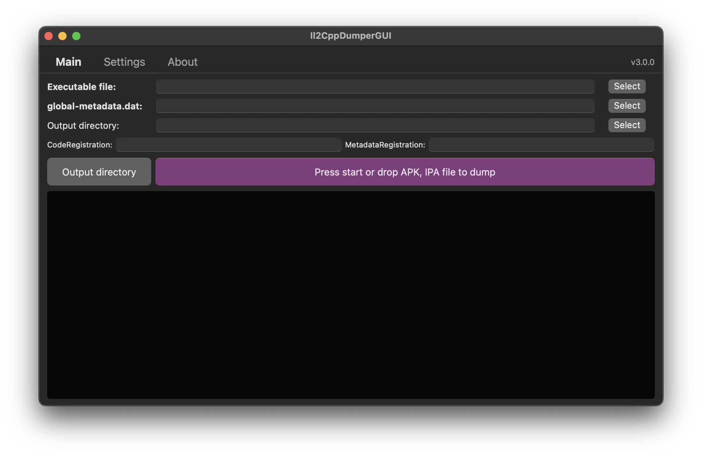
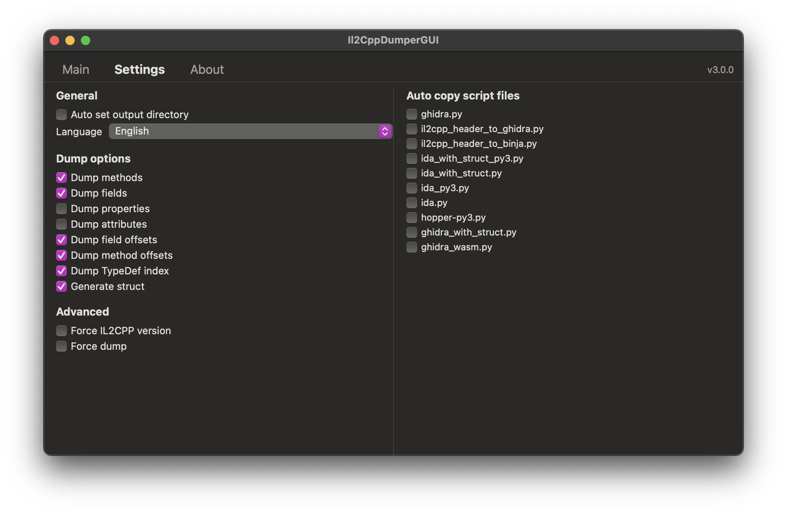
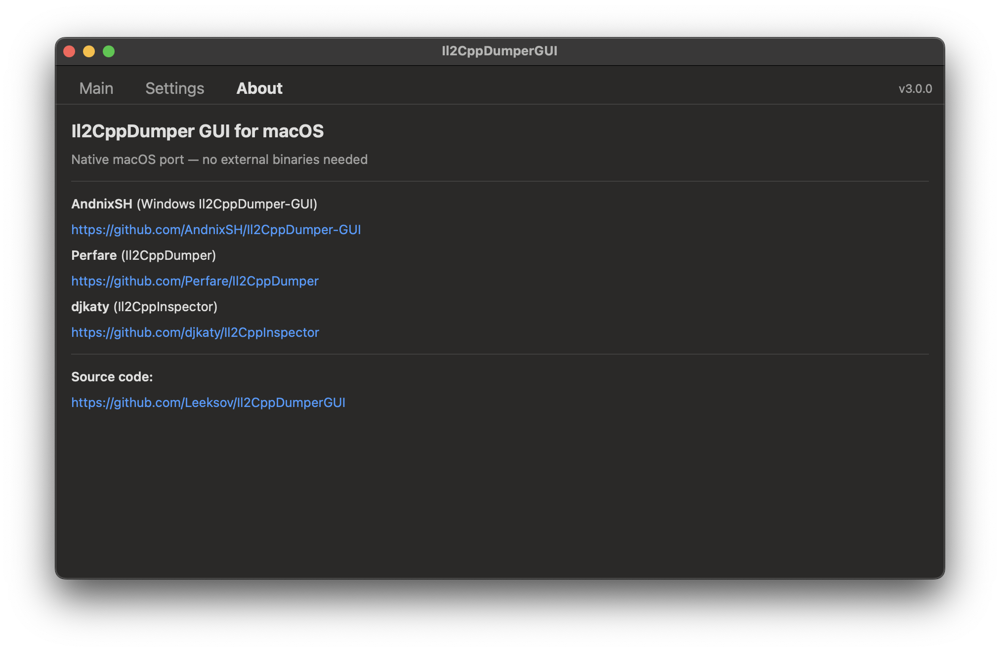

# Il2CppDumper GUI for macOS

Native macOS GUI for [Il2CppDumper](https://github.com/Perfare/Il2CppDumper) — dump IL2CPP Unity games without external binaries.

## Features

- **Native C++ dumper** — no external binaries, all parsing built-in
- **IPA / APK / XAPK / APKS auto-extraction** — drag & drop archive to dump
- **All binary formats** — PE, ELF32/64, Mach-O 32/64, Fat Mach-O, WebAssembly, NSO
- **IL2CPP versions 16–31** with automatic version detection
- **Full dump output:**
  - `dump.cs` — C# pseudocode (types, methods, fields, properties)
  - `script.json` — for Ghidra / IDA / Binary Ninja
  - `stringliteral.json` — all string literals with addresses
  - `il2cpp.h` — C/C++ header with struct definitions
  - `DummyDll/` — dummy .NET assemblies for dnSpy
- **Configurable dump options** — methods, fields, properties, attributes, offsets
- **Force IL2CPP version** / **Force dump** mode
- **Manual CodeRegistration / MetadataRegistration** input
- **Script auto-copy** — Ghidra, IDA, Binary Ninja, Hopper scripts
- **Drag & Drop** — drop files directly onto the start button
- **Localization** — English / Russian / Chinese
- **Universal binary** — Apple Silicon (arm64) + Intel (x86_64)
- **macOS 12.0+** compatible

## Screenshots

| Main | Settings | About |
|------|----------|-------|
|  |  |  |

## How It Works

1. **Core dump** (`dump.cs`) is generated natively in C++ — fast, no dependencies
2. **Post-processing** (struct generation + dummy DLL) uses a bundled self-contained .NET tool
3. **IPA/APK** files are automatically extracted, binary and metadata located, then dumped

## Usage

1. Open the app
2. Drag & drop an IPA, APK, or XAPK file onto the **Start** button
   - Or manually select executable, global-metadata.dat, and output directory
3. Press **Start** — dump.cs and all supporting files will be generated

## Building

### Requirements
- Xcode 14+
- macOS 12.0+
- Docker (for building the post-process tool)

### Build Steps

```bash
# Clone
git clone https://github.com/Leeksov/Il2CppDumperGUI.git
cd Il2CppDumperGUI

# Build post-process tool (StructGenerator + DummyDLL)
./build_postprocess.sh

# Open in Xcode and build
open Il2CppDumperGUI.xcodeproj
```
## Credits

- [AndnixSH](https://github.com/AndnixSH/Il2CppDumper-GUI) — Windows Il2CppDumper-GUI (original GUI design)
- [Perfare](https://github.com/Perfare/Il2CppDumper) — Il2CppDumper (core dumping logic)
- [djkaty](https://github.com/djkaty/Il2CppInspector) — Il2CppInspector (contributions)
- [Leeksov](https://github.com/Leeksov/Il2CppDumperGUI) — Il2CppDumperGUI (Original author of Il2CppDumper GUI)

## License

This project is for educational and research purposes.
